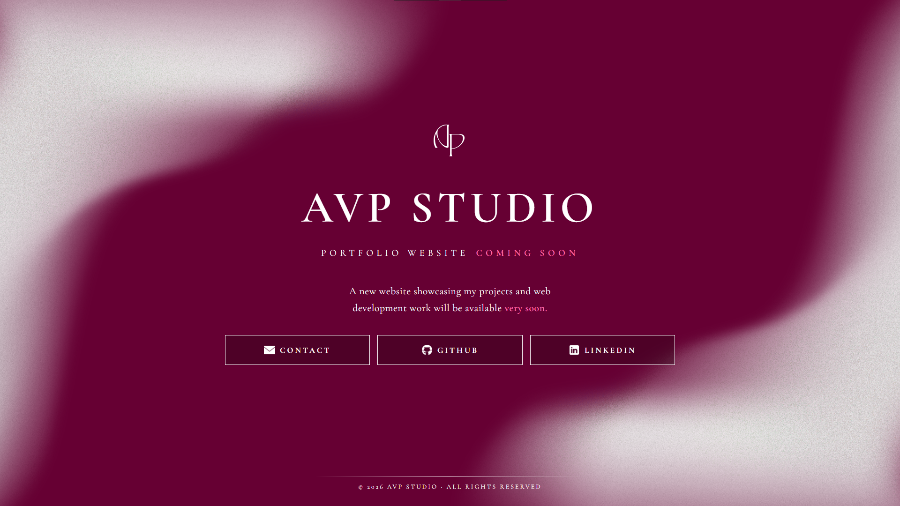

# AVP Studio - Parking Page

Temporary landing page for `avpstudio.es` while the full portfolio website is under development.

## Status

Parking page completed.

- Scope of this repo: finished "Coming Soon" page.
- Full portfolio website: pending future release.

## Preview



## Tech Stack

- HTML5
- CSS3

## Project Structure

```text
.
|-- index.html
|-- assets/
|   |-- styles.css
|   |-- icons/
|   |   |-- email.png
|   |   |-- github.png
|   |   `-- linkedin.png
|   `-- images/
|       |-- background.png
|       |-- logo.svg
|       |-- preview.png
|       `-- screenshot.png
|-- favicon.ico
|-- robots.txt
`-- README.md
```

## Local Run

Open `index.html` directly in the browser, or run a local static server.

## Author

Alejandro Vazquez
